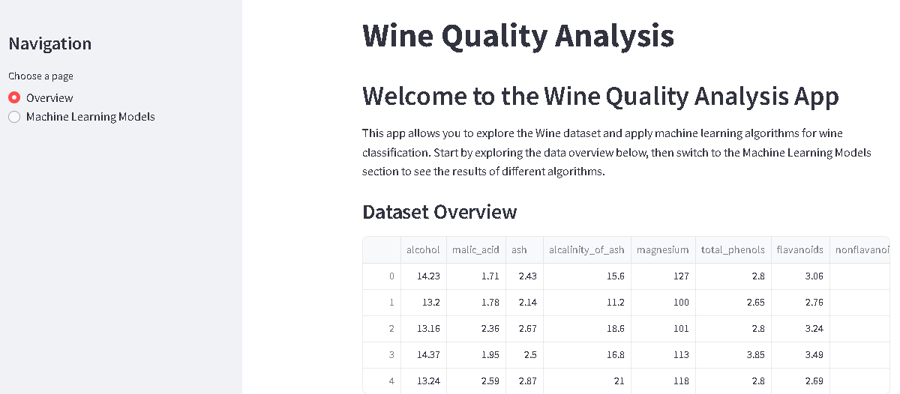
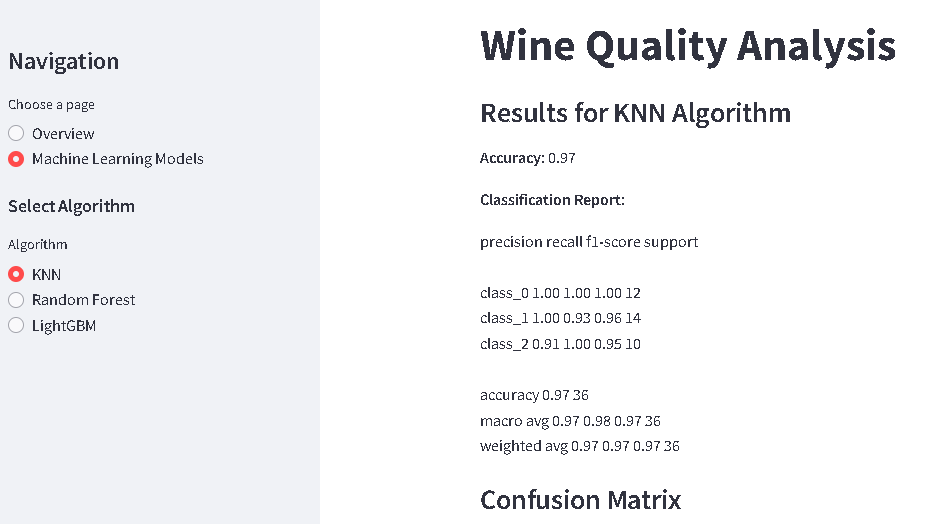

# Wine Classification with Machine Learning

This machine learning project uses the Wine dataset for classification with three algorithms: KNN, Random Forest, and LightGBM. The repository contains a Jupyter Notebook for data analysis and model training, along with a Streamlit app for interactive results exploration.

---

### Key Information:
- **Source:** The dataset is part of the `scikit-learn` library (`sklearn.datasets.load_wine`).
- **Number of Samples:** 178 wines.
- **Number of Features:** 13 chemical properties:
  - Alcohol
  - Malic acid
  - Ash
  - Alkalinity of ash
  - Magnesium
  - Total phenols
  - Flavanoids
  - Nonflavanoid phenols
  - Proanthocyanins
  - Color intensity
  - Hue
  - OD280/OD315 of diluted wines
  - Proline
- **Target Classes:**  
  The dataset contains three target classes representing different grape cultivars (varieties of grapes):
  - Class 0: Cultivar A
  - Class 1: Cultivar B
  - Class 2: Cultivar C

### Purpose:
The dataset is used to classify wines into one of these three cultivars based on their chemical attributes. Note that:
- The classes are **not related to wine quality**. They represent grape types used to make the wines.
- This dataset is ideal for exploring classification algorithms like logistic regression, decision trees, or k-nearest neighbors.

### Practical Applications:
- **Feature Selection:** Identify which chemical properties most influence wine classification.
- **Data Visualization:** Understand the relationships between chemical features and wine types.
- **Model Building:** Train machine learning models to classify wines based on their chemical composition.

---

## Project Overview

In this project, we explore the Wine dataset to classify wines into different categories based on various features such as alcohol content, color intensity, and more. The classification is performed using three machine learning algorithms:

- **K-Nearest Neighbors (KNN)**
- **Random Forest**
- **LightGBM**

The project is divided into two main parts:
1. **Jupyter Notebook**: Used for data exploration, preprocessing, model training, and evaluation.
2. **Streamlit App**: Provides an interactive interface to visualize the results and select different machine learning models for predictions.

---

## Files in the Repository

- **`wine.ipynb`**: Jupyter Notebook containing the data analysis and machine learning model training process.
- **`streamlit_wine_app.py`**: Streamlit application for interactive results exploration.

---

## Required Dependencies

This project requires the following Python libraries:

- `pandas` for data manipulation
- `numpy` for numerical computations
- `matplotlib` for data visualization
- `seaborn` for statistical data visualization
- `scikit-learn` for machine learning models and metrics
- `lightgbm` for the LightGBM algorithm
- `streamlit` for creating the interactive web app

---

## Setup and Installation

1. Clone this repository to your local machine.
2. Create a virtual environment (optional but recommended):
   ```bash
   python -m venv venv
   ```
3. Install the required dependencies
4. Run the Streamlit app:
   ```bash
   streamlit run wine_app.py
   ```
---

## Usage
1. Upon launching the Streamlit app, the main page will display information about the Wine dataset.
2. From there, you can choose one of the machine learning algorithms (KNN, Random Forest, or LightGBM) to see the results of the classification model.

---
## Screenshots

### Main Page


### Machine Learning Model Selection


---

## Licence
This project is open-source and available under the MIT License.

